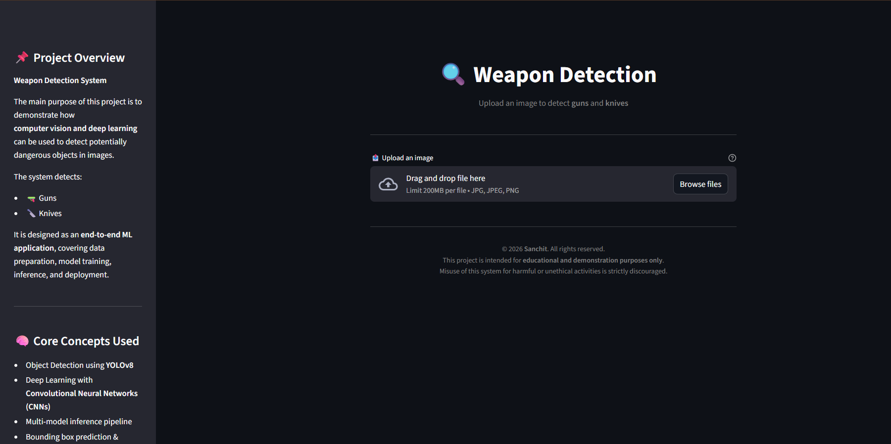
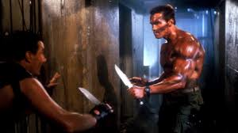
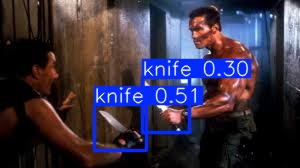

# 🔍 Weapon Detection System (YOLOv8)
[](https://weapon-detection-sanchitk99.streamlit.app/)

An end-to-end **computer vision application** that detects **guns and knives** in images using **YOLOv8** and a **Streamlit web interface**.

---

## 🌐 Live Demo

👉 **Try the app here:**  
https://weapon-detection-sanchitk99.streamlit.app/

---

## 🎯 Project Purpose
This project demonstrates how **deep learning and object detection** can be applied to identify potentially dangerous objects in images.  
It covers the full ML lifecycle: data preparation, model training, inference, and deployment.

---

## 🚀 Demo


---

## 📸 Screenshots

### 🖥️ Application Interface


### 📤 Image Upload


### 📌 Detection Result


---

## 🧠 Core Concepts Used
- Object Detection with **YOLOv8**
- Convolutional Neural Networks (CNNs)
- Transfer Learning
- Multi-model inference pipeline
- Bounding box prediction & confidence scoring

---

## 🛠️ Tech Stack
- Python
- YOLOv8 (Ultralytics)
- PyTorch
- OpenCV
- Streamlit

---

## 📂 Project Structure

```text
weapon-detection/
│── app.py                 # Streamlit application
│── predict_utils.py       # Inference logic (gun + knife models)
│── train.py               # Gun model training
│── predict.py             # CLI inference script
│
│── datasets/              # Weapon datasets
│── knife_dataset/         # Knife-specific dataset
│── models/                # Trained model weights
│
│── assets/
│   ├── screenshots/       # UI screenshots
│   └── demo/              # Demo GIF
│
│── requirements.txt
│── README.md
│── .gitignore

---

## 📦 Requirements
1️⃣ Install dependencies using:

```bash
pip install -r requirements.txt

2️⃣ Run the application
streamlit run app.py